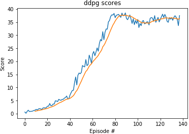

# Project context

In this project, we use the [Reacher](https://github.com/Unity-Technologies/ml-agents/blob/master/docs/Learning-Environment-Examples.md#reacher) environment that contains 20 identical agents, each with its own copy of the environment, in which a double-jointed arm can move to target locations.

A reward of +0.1 is provided for each step that the agent's hand is in the goal location. Thus, the goal of your agent is to maintain its position at the target location for as many time steps as possible.

The observation space consists of 33 variables corresponding to position, rotation, velocity, and angular velocities of the arm. Given this information, the agent has to learn how to best select actions. Each action is a vector with four numbers, corresponding to torque applicable to two joints. Every entry in the action vector should be a number between -1 and 1.

In order to solve the environment, the agents must get an average score of +30 over 100 consecutive episodes and over all agents.

# Learning algorithm
We implement a policy-based method called **Deep Deterministic Policy Gradients** ([DDPG](https://pemami4911.github.io/blog/2016/08/21/ddpg-rl.html)). Policy-based methods are well-suited for continuous action spaces and directly learn the optimal policy without having to estimate a separate value function as value-based methods.

In the original [paper](https://arxiv.org/pdf/1509.02971.pdf) of Google Deepmind, DDPG comes as a result of tailoring _the ideas underlying the success of Deep Q-Learning to the continuous action domain_.

As a base, I used [this implementation](https://github.com/udacity/deep-reinforcement-learning/tree/master/ddpg-pendulum) of a single-agent DDPG by Udacity and adapt it to a multiple-agent DDPG.

Just like in the first project, target and local networks are used to stabilize the training process by decoupling the selection and evaluation of an action.

Moreover, the previous paper states that :
> A major challenge of learning in continuous action spaces is exploration.

As it is suggested in the paper, we use the Ornstein-Uhlenbeck (OU) process to ensure that there is a good trade-off between exploration and exploitation, for it adds a certain amount of noise sampled from a noise process to the action values.

In order to further stabilize the training process, we apply replay buffer which memorizes experiences of the Agents. During learning, the DDPG agent updates is applied on samples (or minibatches of size `BATCH_SIZE`) of experience drawn uniformly at random from the pool of stored samples of size `BUFFER_SIZE`.


| Parameter | |
|-|-|
| theta (OU noise parameter)| 0.15 |
| sigma (OU noise parameter) | 0.2 |
| BATCH_SIZE| 128 |
| BUFFER_SIZE | 100 000 |

# Architecture

The model architecture consists of a Actor and Critic neural network, each of two layers network with 256 and 128 hidden units and input state size of 33 dimensions and output actions size of 4. All these layers are separated by Rectifier Linear Units (ReLu). The hyperbolic tangent (tanh) is applied before the output of the actor network to ensure that values are between -1 and 1.

## Optimization
The optimization employed to train the
network is Adam with a learning rate set to `LR = 0.0001` and a weight decay set to `WEIGHT_DECAY = 0` (and other default parameters from PyTorch library) for both the actor and critic networks.

# Plot of Rewards
The environment has been solve in around 38 episodes ! Below is the plot of the agent's rewards.

```
Episode 100	Average Score: 17.63
Episode 138	Average Score: 30.15
Environment solved in 38 episodes!	Average Score: 30.15
```


We can follow the trained agents for one episode here:


# Ideas for future works
For future works, we can add **batch normalization** between layers. Indeed, according to the above paper, differences in the physical units can _can make it difficult for the network to learn effectively and may make it difficult to find hyper-parameters which generalise across environments with different scales of state values_.

We can also implement **gradient clipping** to ensure that exploding gradients are never an issue.

Finally, we can speed up the training process by only updating the agent 10 times every 20 timesteps.

We can also experiment with other algorithms such as Trust Region Policy Optimization (TRPO), Proximal Policy Optimization (PPO) or Distributed Distributional Deterministic Policy Gradients (D4PG).
